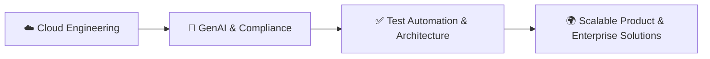

# 👋 Hi, I'm Siva Subramanian

🚀 **Test Architect | Cloud Engineer | Hackathon Strategist**  
💼 17+ years of industry experience in QA, automation, and cloud engineering.  
🌐 Building **compliance‑first GenAI platforms** and scalable cloud solutions.  

---

## ✨ About Me
- 🧭 **Test Architect** at Synchronoss Technologies with 17+ years in Research, Development, Quality Assurance and Cloud Engineering in Telecom domain.  
- ☁️ Skilled in **Google Cloud Platform (GCP)**, **AWS**, and **infrastructure‑as‑code**.  
- 💻 Strong coding background in **Java**, **Python**, **JavaScript**, **JRuby**, **Groovy**, **Shell Script**, **SpringBoot**, **RestAssured**, **Appium**, **Selenium** and **TypeScript**.
- 💻 Strong foundation in **Spring Boot frameworks**, coupled with my knowledge of **Docker, Kubernetes, and Kafka** — the cornerstones of modern cloud‑based applications.
- 🏆 Hackathon strategist — known for rapid prototyping, reproducible workflows, and investor‑ready storytelling.  
- 🌍 Passionate about **compliance‑first GenAI** for healthcare and regulated industries.
- 💬 Ask me about **test architecture, cloud engineering (GCP/AWS), hackathon strategy, and building investor‑ready prototypes**.
- 📫 How to reach me: [LinkedIn](https://www.linkedin.com/in/sivasubramanian86/) | [GitHub](https://github.com/sivasubramanian86)  
- 😄 Pronouns: He/Him  
- ⚡ Fun fact: I’ve turned hackathon prototypes into full‑fledged products — and I love blending **technical rigor with business storytelling**.  

## 🌱 Currently Working, Learning & Exploring

- 🔭 I’m currently working on compliance‑first **GenAI and Agentic AI** platform projects.
- 🌱 I’m currently applying **Advanced GenAI integrations** on cloud service providers like **GCP (Vertex AI, Cloud DLP, FHIR API)** and **AWS**, focusing on compliance‑first solutions.  
- 🌱 I’m also diving into **MCP, Agentic RAG, Security Guardrails, LLM Eval Libraries**, and experimenting with **agentic workflows** using tools like **n8n** and **Flowise** — all while scaling reproducible **CI/CD pipelines**.
- 👯 I’m looking to collaborate on **cloud‑native, secrutity-compliance-governance‑driven AI solutions** that can scale globally.
- 🤔 I’m looking for help with **expanding adoption of audit‑proof GenAI platforms** in regulated industries.

## 🚀 Expanding my expertise in **modern deployments**

  - 🔥Hosting full‑stack apps on **Firebase**   
  - ▲ Deploying serverless and static sites on **Vercel**   
  - ☁️Leveraging **Cloud Run, Netlify, and GitHub Pages** for rapid, innovative and demo‑ready launches.  

---

### 🔧 Tech Toolbox

---

## 📊 Innovation Stack

---

## 📌 Featured Projects
Here are some of my recent projects (pinned on profile):  

- **[HealthCheckQAGenAgent](#)** – Compliance‑first QA platform for healthcare.  
- **[StratOpsAI](#)** – Strategic operations AI with reproducible workflows.  
- **[VerdaClimeAI](#)** – Real‑time visualization of climate & agricultural data.  

---

## 📊 GitHub Stats & Widgets
  
  
  
  

---

## 🚀 Roadmap
- [x] Build compliance‑first GenAI QA prototype.  
- [x] Launch hackathon‑ready demo with reproducibility.  
- [ ] Scale HealthCheckQAGenAgent into a global healthcare QA platform.  
- [ ] Add federated compliance learning & multilingual support.  
- [ ] Expand portfolio with investor‑friendly case studies.  

---

## 🤝 Connect With Me
- 💼 [LinkedIn](https://www.linkedin.com/in/sivasubramanian86/)  
- 📧 Email: *sivasubramanian86@hotmail.com*

---

⭐️ *“Let’s build the next compliance‑first innovation together.”*  
